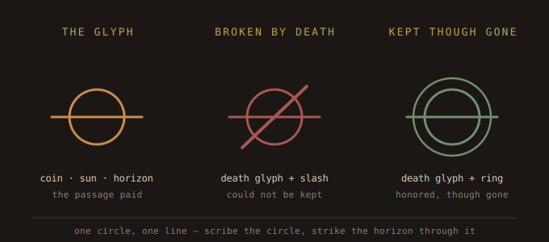

# The Weight — Fate-Language Lexicon

A personal, mythic vocabulary of marks engraved onto discs to record what became
of a promise. This is the master dictionary; the app stores per-disc records, this
holds the *meaning*. Built slowly, one glyph at a time.

---

## The founding principle

**Borrow meanings, not symbols.** The language draws from many traditions — Norse,
Greek, Egyptian, alchemical, and an invented personal mythology — but every glyph is
rendered in one consistent hand, so the system is *yours*, not a scrapbook of other
people's symbols. Mythologies feed the meaning; your hand unifies the look.

## The grammar

Every fate-mark is built from:

1. **Base stroke = the fate** (fixed, never varies)
   - **Kept** → an enclosing **ring** around the mark (the promise came full circle).
   - **Broken** → a severing **slash** through the mark (cancelled, let go — honest, not cruel).
2. **Stroke weight = severity** (Axis B)
   - Light / short stroke = minor. Deep / long stroke = grave.
3. **The glyph = the circumstance** (drawn from this lexicon — the part that grows).
4. **Placement** — on the **back** of the disc, keeping the front (identity) dignified.
   Marks accrete over a disc's life, read in chronological order, so a disc carries
   its whole story.

A disc can combine base + glyph: e.g. *broken-slash + death glyph* = "could not be
kept, they died"; *kept-ring + death glyph* = "honored, though they're gone."

---

## Glyph 1 — DEATH ("the passage")

**Meaning:** A promise touched by the death of the person it was made to. As a
*broken* mark: it can never be kept because they are gone (not your failure). As a
*kept* mark: you fulfilled it before or after they passed — the most poignant
combination the language can make.

**Mythic roots (blended):**
- **Charon's obol** (Greek) — the coin placed with the dead to pay passage across
  the Styx. Resonant because these tokens *are* coins; the promise becomes a fare paid.
- **The setting sun** — life passing below the horizon.

**The glyph:** a **circle** (the coin / the soul / the sun) crossed through its center
by a single **horizontal line** (the horizon, the line of passage). The line may
extend slightly past the circle on both sides, to read as a horizon rather than a
"no entry" sign.

**Engraving form:** one scribed or freehand circle + one straight horizontal strike
through it. About as simple as the language gets.

**Combinations:**
- *broken-slash + death glyph* → could not be kept; they died.
- *kept-ring + death glyph* → kept, though they are gone.

**Special behavior — when a person dies:**
- The death glyph is added to **each** of that person's affected discs.
- A dedicated **memorial disc** is made (their name/initial + death glyph + date) and
  kept in a **separate small memorial vessel** — never filed under "broken," because
  the dead are not failures.
- (App side, planned) the person is marked gone; their promises are flagged; a
  memorial view gathers the whole relationship and what became of each promise.

---

## Lexicon index (growing)

| # | Glyph | Image | Meaning | Fate it modifies |
|---|-------|-------|---------|------------------|
| 1 | Death / the passage |  | promise touched by a death | broken or kept |

*(more to come — we add glyphs one at a time)*

> **Image convention:** each glyph has two SVGs in the `glyphs/` folder — a small
> standalone (`NN-name.svg`) used in the index, and a combinations sheet
> (`NN-name-combinations.svg`) shown in the glyph's full entry. SVGs are sharp at any
> size, render in GitHub and browsers, and can be opened larger at the bench.

---

## Candidate glyphs to design next (parking lot)

Ideas raised but not yet designed, so they're not lost:
- **Broken — abandoned** (you simply let it fall — the "your fault" mark)
- **Broken — made impossible** (force stopped by something outside you)
- **Broken — outgrown** (no longer yours to keep; natural passing)
- **Broken — betrayal of self**
- **Kept — at great sacrifice** (forged through cost)
- **Kept — easily / naturally**
- **Kept — long overdue** (time crossed)
- Modifiers for **favors**: redeemed, transferred, called-in
- A **promotion** mark (open → standing)

We'll pull from this list and invent new ones as situations call for them.
