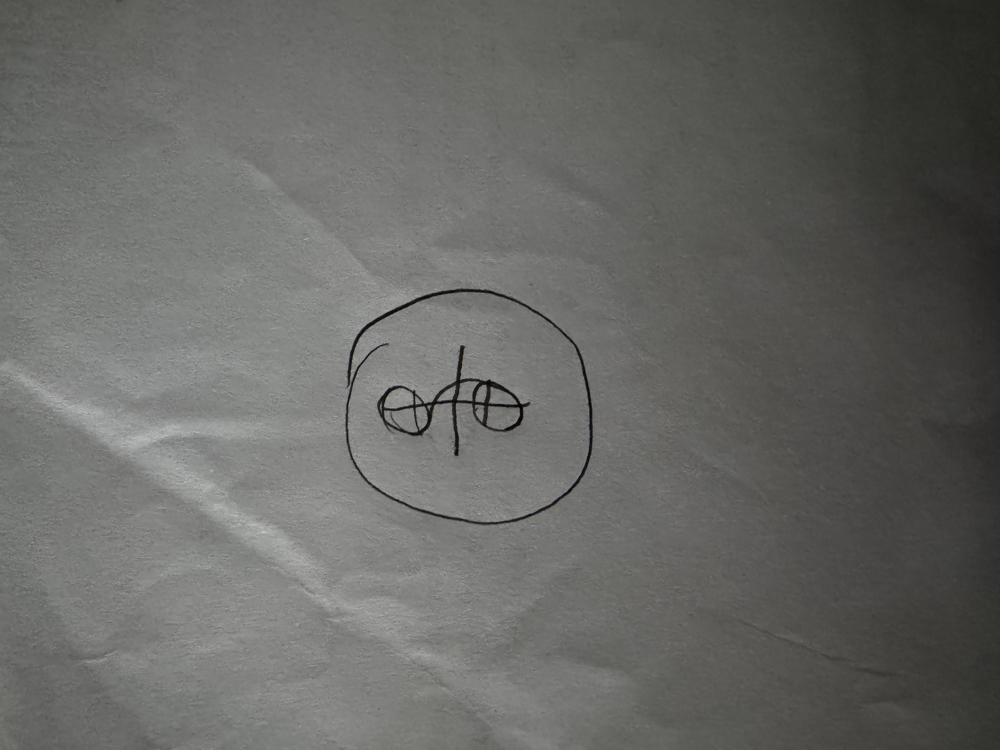
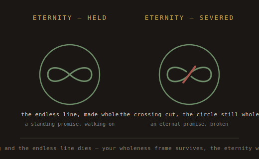
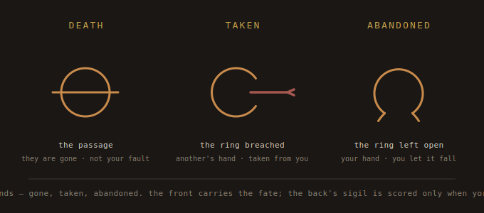
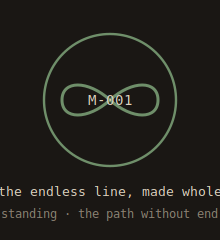
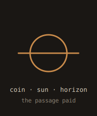
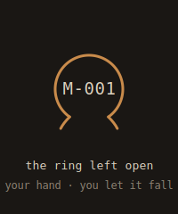
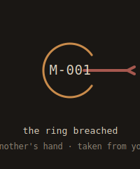

# The Weight — Fate-Language: Dictionary & Grammar

A personal, mythic language of marks engraved onto discs to record what became of
a promise. Two layers:

- **The dictionary** — the *fates*. What ended a promise, and how. The growing
  vocabulary (this is the open class — we add to it together).
- **The grammar** — the *transformations*. How a fate is changed, intensified,
  combined, and chained over a disc's life. A smaller, fixed set of rules that lets
  the language stay living: you can build new meaning at the bench without waiting
  for a new glyph.

The app stores the per-disc record; this document holds the *meaning*.

---

## The founding principle

**Borrow meanings, not symbols.** The language draws from many traditions — Norse,
Greek, Egyptian, alchemical, and an invented personal mythology — but every glyph is
rendered in one consistent hand, so the system is *yours*, not a scrapbook of other
people's symbols. Mythologies feed the meaning; your hand unifies the look.

**Straight vs. curved** (set by the maker's mark, carried by everything):
straight strokes = the fixed / binding; curved strokes = the living / cyclical.

---

## The two faces of a disc

The layout (this supersedes the earlier "marks on the back" convention):

- **FRONT — the fate.** Carries the identity label (`M-###` / `O-###` / `F-###`),
  and the **fate-glyph is drawn around / incorporating that label** — the ring
  *encloses* the identity. The front is read as: *this is the promise, and this is
  what became of it.*
- **BACK — the maker's mark, enlarged into a sigil.** Not a small signature but a
  seal covering the coin. The back has exactly **two states**:
  - **Whole sigil** — every promise that is open, standing, kept, or ended through
    no failure of yours.
  - **Wounded sigil** — scored/gouged, *only* for promises **you failed**. Taking a
    tool to your own image. Flip any coin and you know at once whether you failed it.

**What gets marked, by status:**

| Status | Front | Back sigil |
|--------|-------|-----------|
| **Open** | label only — *no fate mark yet* (unresolved, still in play) | whole |
| **Standing** | the **eternity mark** (present-tense, mutable) | whole |
| **Kept** | the **kept-ring** (+ circumstance glyph) | whole |
| **Dead — your fault** | the dead-glyph (+ circumstance) | **wounded** |
| **Dead — not your fault** | the dead-glyph (+ circumstance) | whole |

> **"Dead" is how we name Broken.** Not passive ("it broke") but final ("it died /
> I killed it"). The amber jar is the *dead* jar — for dead promises, distinct from
> the separate memorial vessel for dead *people*. A failed promise is a dead promise;
> whether *you* killed it (your fault) is what the wounded sigil records.

---

## The maker's mark — "The Eternal Path"

The root glyph of the whole system. It signs favor tokens (the un-buyable security
layer), sets the visual hand the fate-glyphs follow, and — enlarged — is the **back
sigil** of every disc. **Hand-drawn** — the file below is a seed/blueprint; the final
line is trued by your own pen.

*(Your hand-drawn mark — the canonical version. The earlier `makers-mark-seed.svg` is
kept only as an early blueprint. This image is replaced when you engrave the final.)*

**Meaning — eternal cycles, repetition, the eternal path trodden, borne through
hardship.** A promise practice *is* an eternal cycle: bind, keep or break, mark,
repeat, for life.

**Elements (as drawn):** the **S** — a vertical S down the center, your initial, and the
crossing-stroke of an (incomplete) vertical lemniscate · **two coils** — a small circle
at the **top end** and the **bottom end** of the S, the S curving into each; these are
the ouroboros turnings / the lemniscate's two loops · **the center bar** — a single
horizontal stroke through the S's waist (the crossing) · **the wholeness circle** — the
outer ring enclosing all, tied to the keystone (CODE / wholeness), drawn with a
deliberate **overshoot tail** at the top where the line curls in without fully closing —
the eternal path left open, still being walked.

> **The S is the eternal line, still being walked.** The lemniscate is left *open*
> (the unclosed outer tail, the S that never seals into a symmetric ∞), so the mark
> reads as the **incomplete** eternal path — the cycle in motion. This sets up the
> deliberate contrast with the eternity *fate-glyph* (Family 1), which **is** a
> *completed* lemniscate within the wholeness circle: signature = the path being walked
> (open); standing-promise mark = the path made truly eternal (closed). Same core,
> differing by completion. Your initial and the infinity sign are the same stroke.

**Two registers of the mark:**
- **Front-of-favor punch** — the small, constant, identically-reproducible version.
  This is the security layer; it must never vary (consistency is what makes it
  recognizable and forgery-resistant).
- **Back sigil** — the enlarged seal on the back of every disc. This is the one that
  gets **wounded** when you fail a promise.

> **The security rule, restated for the favor case:** a favor token only needs its
> mark pristine *while in circulation* (outstanding → redeemed). Once it resolves and
> comes home — kept or dead — it has left circulation, so scoring its back sigil then
> costs nothing in forgery terms. **Never wound a favor still in the world; only once
> it's returned to you and dead.**

---

## ───────────────  THE DICTIONARY  ───────────────

The fates, by family. Some are **drawn** (an SVG exists); some are **seeded**
(meaning fixed, glyph still to draw); some are **open** (named, awaiting design). We
populate this together — the goal is *every fate that can be thought of*.

### Family 0 — The base fates (the spine of every mark)

These are the terminal outcomes every circumstance attaches to.

| Fate | Mark | Meaning | State |
|------|------|---------|-------|
| **Kept** | enclosing **ring** (closed, around the label) | the promise came full circle | drawn (ring) |
| **Dead** | the ring **not closed** / severing stroke | the promise ended unkept | drawn (see below) |
| **Standing** | the **eternity mark** (lemniscate within the wholeness circle) | a living, never-finished promise | drawn |
| **Open** | *no mark* | still in play | n/a |

### Family 1 — STANDING / the eternal

- **Eternity — held** *(drawn)* — `04-eternity.svg`. A **lemniscate** (the sideways-8,
  ∞) nested **inside the wholeness circle** — two eternity symbols in one mark: the
  endless crossing line within the closed whole. The lemniscate is one unbroken line
  that crosses itself at the centre and never lands — endlessness through continuous
  return, not a closed loop; the wholeness circle is your signature frame, tied to the
  keystone (CODE / wholeness). The label sits **at the crossing, inside the ring** — the
  still point where the eternal line meets itself, held within the whole. Curved =
  living. Worn by a standing promise while it lives. **Mutable by design.**
  *Myth/symbology: the lemniscate (Wallis's 1655 infinity sign, but the figure is far
  older); the **ouroboros** — the snake eating its tail, eternal return (a lemniscate is
  an ouroboros with a twist at the middle); the **endless knot** (Celtic, and the
  Buddhist shrivatsa) — a single line with no beginning or end. The enclosing circle
  rhymes with the maker's mark's own wholeness circle, so standing promises carry the
  signature's eternal-path DNA. **Note the deliberate contrast:** the maker's mark is
  the *incomplete* lemniscate (the S — the path still being walked); this glyph is the
  *completed* lemniscate (the path made truly eternal). Signature = walking; standing =
  the cycle closed.*
- **Eternity — severed** *(drawn)* — the **crossing of the lemniscate is cut**, while
  the **wholeness circle stays intact**. The crossing *is* the meaning of the inner
  figure; cut it and the endless line dies into two dead arcs. Leaving the outer circle
  whole is itself meaningful: your wholeness frame survives, but the eternity it held is
  broken. A sharper "you cut the path to eternity" than slashing a ring — you broke the
  line at exactly the point that made it eternal. Front-face partner to the wounded back
  sigil. *Myth: the ouroboros denied — the cycle refused, the line that no longer
  returns.*
- **Eternity — renewed / deepened** *(open)* — a standing promise re-affirmed or made
  heavier. Candidate: a second crossing, or a doubled circle.

### Family 2 — Ways a promise was KEPT (kept-ring + circumstance)

The good family. All carry the closed ring; the circumstance says *how*.

- **Kept — plainly** *(seeded)* — the bare kept-ring, nothing added.
- **Kept — at great sacrifice** *(open)* — forged through cost. Candidate: the three
  trial-bars (from the maker's mark) crossing the ring.
- **Kept — easily / naturally** *(open)* — it cost you nothing; grace. Candidate: a
  light, single-stroke ring.
- **Kept — long overdue** *(open)* — kept, but late; time crossed. Candidate: the
  horizon line (death's stroke) *under* a closed ring — time passed, still honored.
- **Kept — though they are gone** *(drawn, see Family 4)* — kept-ring + death glyph.
- **Kept — by another's help** *(open)* — you did not keep it alone.

### Family 3 — Ways a promise DIED, BY YOUR HAND (dead + wounded sigil)

The hardest family. All carry the **wounded back sigil**. The front says *how you
killed it*. These map to the *will not* opening of the Breaking ritual — a rebuke.

- **Abandoned** *(drawn)* — `02-abandoned.svg`. The ring **left open at the bottom**,
  ends splayed like a wound that won't close — you let it fall. *Myth (blended):
  Penelope's unwoven web (the work deliberately left unfinished); the broken oath /
  Norse níð (the ring that failed to become whole, diminished); the ouroboros denied
  (the cycle you refused to close).* The gap is at the **bottom** — something dropped
  out, "let it fall from me."
- **Betrayal of self** *(open)* — you broke a promise to who you meant to be.
  Candidate: the ring open *and* the spine (the self / backbone) cut.
- **Neglected** *(open)* — not a sharp drop but a slow death by inattention. Candidate:
  the ring fading / dashed rather than splayed.
- **Chose otherwise** *(open)* — broken on purpose for a competing value. Candidate:
  the ring open with the gap turned *aside* (deliberate, not dropped).

### Family 4 — Ways a promise DIED, NOT BY YOUR HAND (dead + whole sigil)

Failed, but no rebuke — the back sigil stays **whole**. These map to the *taken*
opening of the Breaking ritual — mourning, not indictment.

- **Death (the passage)** *(drawn)* — `01-death.svg`. A whole circle crossed by a
  horizontal **horizon** line. A promise touched by the death of the person it was
  made to. *Myth: Charon's obol (the coin paid for passage across the Styx — these
  tokens are coins); the setting sun (life below the horizon).* See special behavior
  below.
- **Taken** *(drawn)* — `03-taken.svg`. The ring **breached from the side** by a heavy
  stroke entering **from outside the disc** — someone else wounding it. The external
  origin is the whole meaning: not your wound to own. *Pairs against abandoned: same
  unclosed ring, but the wound comes from beyond, not from your own hand.*
- **Made impossible** *(open)* — no person at fault, but a force outside you ended it.
  Candidate: the ring broken by a stroke from outside, but blunt/natural rather than
  the struck point of *taken*.
- **Outgrown** *(open)* — no longer yours to keep; a natural passing, no failure.
  Candidate: the ring opening *outward* into a larger arc — grown past.
- **Superseded** *(open)* — replaced by a truer promise. Candidate: a new small ring
  budding from the old one's gap.

### Family 5 — FAVOR fates (the bearer token's own life)

A favor is bound to **whoever holds the disc**, not to a named person — so it is
**transferable and survives death**: when someone dies the favor simply passes on and
**remains redeemable**. Death is not a fate-event for a favor; it is only a change of
holder. The favor family is about *circulation*, not relationship.

- **Outstanding** *(no mark)* — issued, in the world, not yet called in.
- **Transferred** *(no mark — a fact, not a fate)* — changed hands. The ledger tracks
  it; the disc stays unmarked until it reaches a real fate.
- **Redeemed / called-in** *(seeded)* — cashed in; you now owe the favor. Candidate: a
  small inward tick on the ring (the call).
- **Kept** *(seeded)* — you performed the favor. The kept-ring. Back sigil whole.
- **Forgiven** *(open)* — the holder released you without your performing it. A good
  end you did not have to earn. Candidate: the kept-ring, lightly broken — released,
  not failed. Back sigil **whole**.
- **Dead** *(seeded)* — redeemed but not delivered. You failed it. Back sigil
  **wounded** — *but only once the disc has returned to you and left circulation.*

### Family 6 — Meta / life-event marks

- **Promotion (open → standing)** *(open)* — an open promise revealed as a forever one.
  Candidate: the open-promise label gaining the eternity mark; or a small upward
  chevron added when re-stamped in copper.
- **Memorial (a person's death)** *(seeded — see below)* — a dedicated disc for a
  person who died: their name/initial + death glyph + date, kept in the **separate
  memorial vessel**, never in the dead-promise jar (the dead are not failures).
- **Review-survived** *(open)* — a promise that came through a periodic reckoning still
  held. Candidate: a small notch added to the spine per review.

**Special behavior — when a person dies:**
- The **death glyph** is added to **each** of that person's affected *personal*
  promises (not favors — those transfer and live on).
- A dedicated **memorial disc** is made and kept in the **separate memorial vessel**.
- (App side, planned) the person is flagged gone; a memorial view gathers the whole
  relationship and what became of each promise.

---

## ───────────────  THE GRAMMAR  ───────────────

The transformations. A fate from the dictionary is the *word*; the grammar is how you
inflect, combine, and chain it. These rules are (mostly) fixed — they're what keeps
the language consistent as the dictionary grows.

### Rule 1 — Severity (inflection by stroke weight)

The same glyph, weighted. **Light / short / shallow** stroke = a minor instance;
**deep / long / heavy** stroke = a grave one. Severity never changes *which* glyph you
use — only how hard it's struck. (A minor abandoned promise and a grave one are the
same mark; the grave one is cut deeper.)

### Rule 2 — Agency / origin (inflection by where the wound comes from)

The productive axis behind abandoned-vs-taken, generalizable to any death-fate:

- **From within** — the stroke originates *inside* the disc / at the mark itself →
  *your* doing → **wounded back sigil**.
- **From without** — the stroke enters *from beyond the disc's edge* → *another's*
  doing or an outside force → **whole back sigil**.

So any new "died" circumstance inherits its blame automatically from *where you cut
it*. This is the single most powerful rule in the grammar — it means you rarely need
a separate "your fault" glyph; the *direction of the stroke* says it.

### Rule 3 — Combination (stacking fates on one disc)

Two marks coexisting on the front, read together:

- **base fate + circumstance** — e.g. *kept-ring + death glyph* = "kept, though they
  are gone"; *dead + death glyph* = "could not be kept; they died."
- **Legal stacks:** one base fate (Family 0/1) + one circumstance (Families 2–4). Don't
  stack two base fates (a promise is kept *or* dead, not both).
- **Spatial rule:** the base fate is the **ring around the label**; the circumstance
  sits **within or across** that ring (death's horizon through it, sacrifice's bars
  across it). The label stays legible — never struck through.

### Rule 4 — Chaining (accretion over time)

A disc carries its whole story. Marks are added **in chronological order** as a
promise's life unfolds, read in sequence:

- A standing promise: **eternity mark** (at binding) → if broken later, **cut the
  crossing** of the lemniscate while leaving the wholeness circle intact (don't add a
  separate slash — *deform the existing mark*; the history is that this *was* eternal
  and you severed the line where it returned on itself, though the whole frame endures).
- An open promise: **no mark** → resolves → gains its **single fate mark**.
- Re-opened/renewed promises (app allows reopen for some states): a new mark accretes
  rather than erasing the old — the disc shows it died and was reborn. **Exception:**
  a promise that died *by your hand* (wounded sigil) is **one-way** — you can make a
  *new, different* promise (new disc) but never resurrect the scored one. A gouged
  sigil cannot un-scar.

### Rule 5 — Modification (bending a glyph to a neighboring meaning)

How to derive a *new* dictionary entry that's automatically "in the language,"
instead of inventing from scratch:

- **Open / close a ring** — closed = kept/eternal; opened = died. *Where* it opens
  carries sub-meaning (bottom = dropped; side = struck; outward = outgrown).
- **Straight ↔ curved swap** — render a stroke straight to say *fixed/binding*, curved
  to say *living/cyclical*. (A binding cut vs. a natural passing.)
- **Double / concentric** — repetition intensifies or makes eternal (two rings =
  deepened; the maker's mark's doubled turnings).
- **Borrow a stroke from another glyph** — e.g. death's horizon line, the maker's
  mark's trial-bars or spine — to compound meaning ("kept but overdue" = kept-ring +
  death's horizon beneath, time crossed but honored).

**To coin a new fate:** name the meaning → find its nearest neighbor already in the
dictionary → apply one modification (Rule 5) and set its agency (Rule 2) and severity
(Rule 1). If it needs more than one modification to read clearly, it's probably two
fates, not one.

---

## Image / file convention

Each glyph has SVGs in the `glyphs/` folder — a standalone (`NN-name.svg`) and, where
useful, a combinations sheet (`NN-name-combinations.svg`). SVGs are sharp at any size,
render on GitHub and in browsers, and open large at the bench. **Keep the `glyphs/`
folder beside this file** or the images won't render.

Drawn so far: `makers-mark.jpeg` (your hand-drawn mark — canonical) ·
`makers-mark-seed.svg` (early blueprint) · `01-death` (+combinations) · `02-abandoned` ·
`03-taken` · `04-eternity` (+combinations) · `bad-ends-combinations`.

> **All SVG glyphs are placeholders in my hand, not yours.** They fix the *structure
> and meaning* so nothing is lost, but the canonical mark is always **your own
> drawing**. As you draw each glyph yourself, replace the SVG with a photo/scan of your
> version (as already done for the maker's mark); when you engrave the final, replace
> that with the engraving. Keep the same filename so the doc references keep resolving.

---

## Lexicon index

| # | Glyph | Image | Family | Meaning | Status |
|---|-------|-------|--------|---------|--------|
| — | Kept-ring | — | base | came full circle | seeded |
| — | Eternity (held) |  | standing | lemniscate within the wholeness circle | drawn |
| — | Eternity (severed) | — | standing | crossing cut, circle intact | drawn (combinations) |
| 1 | Death / the passage |  | died, not your fault | promise touched by a death | drawn |
| 2 | Abandoned |  | died, your fault | you let it fall | drawn |
| 3 | Taken |  | died, not your fault | wounded by another | drawn |

*Open entries (named, awaiting design): kept-at-sacrifice, kept-easily,
kept-overdue, kept-by-help, betrayal-of-self, neglected, chose-otherwise,
made-impossible, outgrown, superseded, favor-redeemed, favor-forgiven, promotion,
review-survived, eternity-renewed. We design these together, one at a time, using the
grammar.*

---

## Still open (honest state of the language)

These were discussed but are **not yet finalized** — flagged so they're not mistaken
for settled:

- The **full fate list is not closed.** "Every fate that can be thought of" is a
  living target; the families above are a working skeleton to add to and prune.
- Most **Family 2–6 glyphs are not drawn** — only their meanings and candidate forms
  are recorded. Each needs a bench drawing in your hand.
- Whether the **app/docs rename "Broken" → "Dead"** wholesale, or keep "Broken" as the
  UI label with "dead" as the lexicon's voice, is undecided.
- The **app currently allows reopen** from Broken/Kept. Rule 4's one-way exception for
  your-fault deaths needs reconciling with that (a scored disc can't un-scar) — a
  product decision, not yet made.
